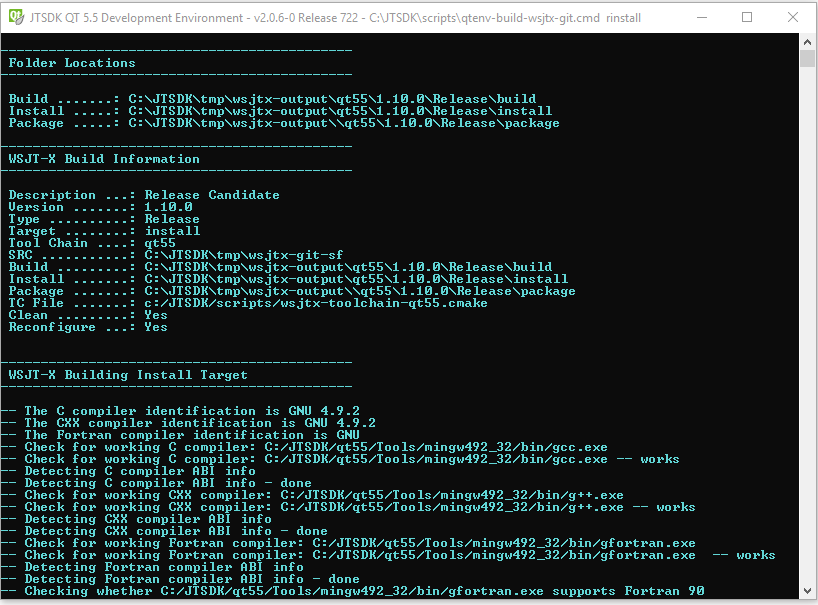
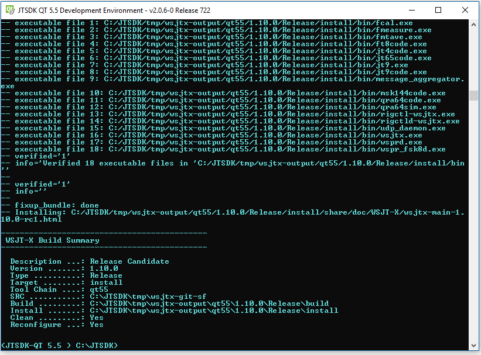
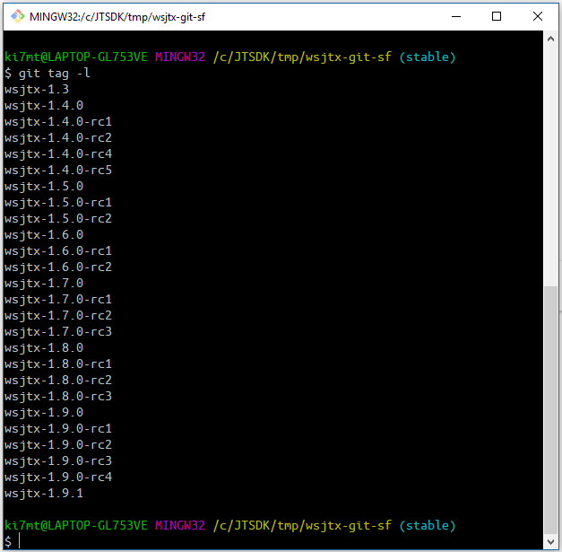
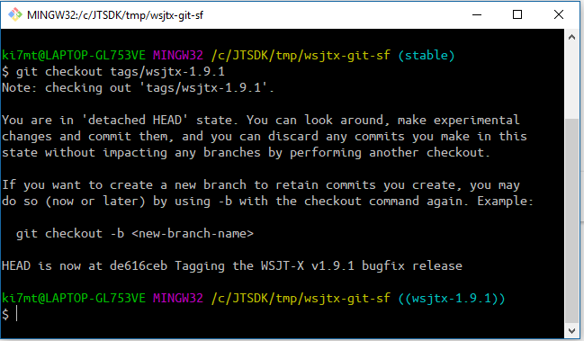
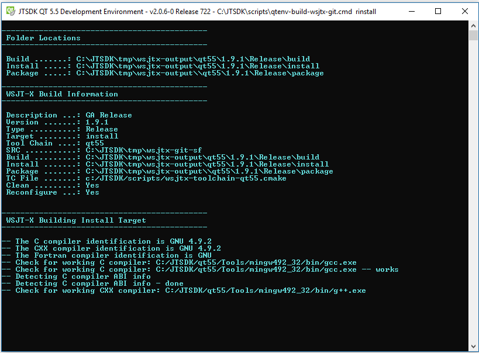
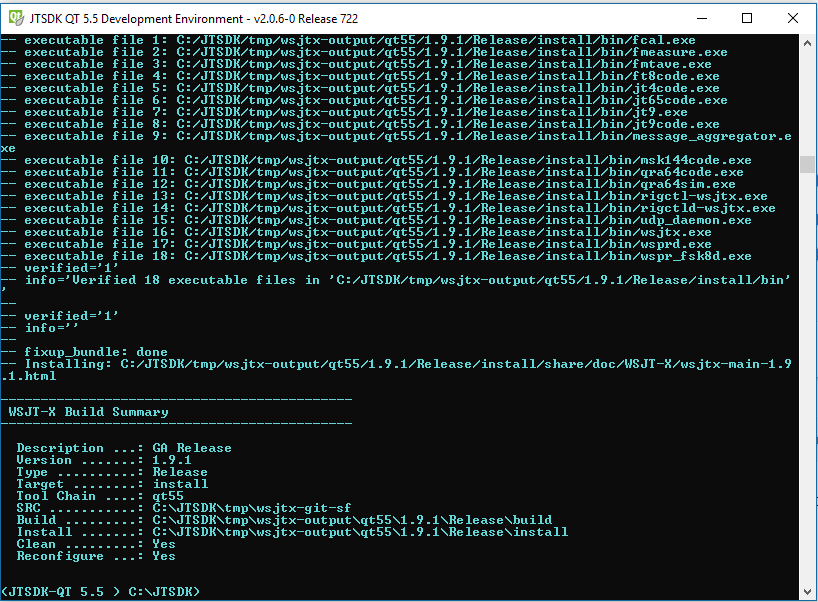
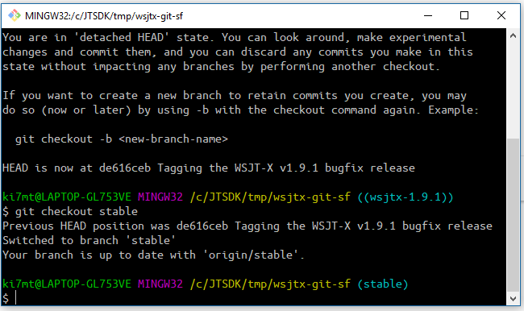
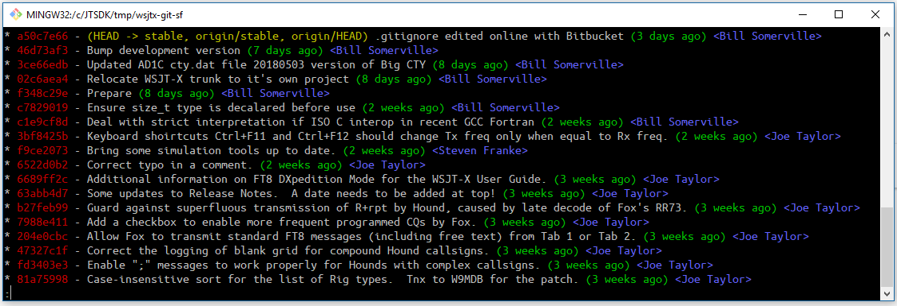

# JTSDK v2 - WSJT-X Git Build Walkthrough
The following is a short walkthrough to build the new 
[WSJT-X Git Repository](https://sourceforge.net/p/wsjt/wsjtx/ci/stable/tree/) using `qtenv-wsjtx-build-git.cmd`.
It does not depend on Git, nor has any interaction with Git. If the
user wishes to build from different URL / Repository, all that is
required is to update the `default.txt` file with the new checkout
path. 

---

## Available Build Commands
>Note - Target specific custom builds have been ommitted from this release. If deemed required, it can be added back in with the next update.
```
# In JTSDK-QT
build-wsjtx-git rinstall
build-wsjtx-git dinstall
build-wsjtx-git rconfig
build-wsjtx-git dconfig
build-wsjtx-git package
build-wsjtx-git docs
```

---

## Build Options
Only four options are available in this script

| Item       | Action             | Description   |
| :---------:|--------------------|---------------|
| qt55       | enable or disable  | Use QT 5.5    |
| clean      | enable or disable  | Clean Build tree before compile |
| rcfg       | enable or disable  | Reconfigure source tree before compile |
| autorun    | enable or disable  | Run WSJT-X after compiling |

The actions are the same as within the standard SVN build script. 

---

## Default Profiles
Source and Destination directories are provided by the default.txt file, located
at `C:\JTSDK\config\default.txt` The `default.txt` file contains just two lines
of interest, SRCD and DEST. Only the paths should change, do not change the prefix.

For this example, the file contains the following:
```
# For use with qtenv-build-wsjtx-git.cmd only
# - Only the paths need to be changed
# - Do not use spaces in the paths as the build will fail
# - Ensure there is only one space between the prefix and path

# Edit the next line to set Source Location
SRCD C:\JTSDK\tmp\wsjtx-git-sf

# Edit the next line to set Destination Directory
DEST C:\JTSDK\tmp\wsjtx-output
```

* SRCD represents the location and name of the of the repsoitory checkout
* DEST is the root locaiton where the artifact will be located.

If you wish to use a different branch checkout, update the SRD path. If
you would like a different Destination directory, update the DEST path.

---
## Building WSJT-X From a Git Repo
It should not matter which repository service is used. For this example, we'll being using `Sourceforge` and the [WSJT-X Repository](https://sourceforge.net/p/wsjt/wsjtx/ci/stable/tree/)

As noted earlier, `JTSDK-QT` does not know of, nor is it concerned with
Git. All repository management should be performed outside of the 
`JTSDK-QT Environment` using an appropriate Git Client.

### Checkout WSJT-X Repository
You can use any Git Client you like. The only things that are of concern to the
build-script is the full path including the ckeckout name, and the destination
directory. For this build example, we'll be using the following:
```
Checkout Type ..........: Anonymous
Git Repo URL ...........: https://git.code.sf.net/p/wsjt/wsjtx 
Git Client .............: Git-Bash or Git-CMD
Source Directory .......: C:\JTSDK\tmp\wsjtx-git-sf
Destination Directory ..: C:\JTSDK\tmp\wsjtx-output
```

#### **Step-1 Checkout WSJT-X Repository**
Open Windows Command Prompt, or Git-Bash terminal and checkout WSJT-X with the
following command:

>Note - You can change the final folder name if you wish. However, make sure to
update the `default.txt` file if you do.

```
# Checkout WSJT-X

* Using Windows Console:
git clone https://git.code.sf.net/p/wsjt/wsjtx C:\JTSDK\tmp\wsjtx-git-sf

* Using Git-Bash
git clone https://git.code.sf.net/p/wsjt/wsjtx /c/JTSDK/tmp/wsjtx-git-sf

Both commands should yeild the same resutls, a new checkout in: C:\JTSDK\tmp\wsjtx-git-sf

```
#### **Step-2 Update default.txt File**
At this point, ensure you have updated both the SRCD and DEST path locations
in `C:\JTSDK\config\default.txt` with your choices in checkout and destination locations.

#### **Step-3 Build the Stable Branch**
You can use any of the items in `Available Build Commands`. For this example
we'll build the Stable Release Install target.
```
# In a Windows or Git-Bash Terminal, change direcotry to the source location

Windows CMD
cd /d C:\JTSDK\tmp\wsjtx-git-sf

Git-Bash:
cd /c/JTSDK/tmp/wsjtx-git-sf

Check which branch you're on with:
git branch

Git should return:
* stable

Open JTSDK-QT
- Ensure your're on QT55
- Ensure you've built Hamlib3, then type:

build-wsjtx-git rinstall

Note: you can use any of the following commands:
   rinstall   Builds the Release Install target
   dinstall   Builds the Debug Instll target
   rconfig    Configure Only Release Install target
   dconfig    Configure Only Debug Install target
   package    Release Install Win32 Installer Package
   docs       Compiles the documentation

The Output should be located at:

Source : C:\JTSDK\tmp\wsjtx-git-sf
Output : C:\JTSDK\tmp\wsjtx-output\qt55\1.10.0\Release\{build, install, package}

```

### **Build Start**



### **Build Summary**



## Step-4 Build a Tag or Branch
Now we'll build a tagged release. The same could be done with
a branch, it's up to the user which they choose to build.

```
Open Git-Bash or Git-CMD
For this esample, I am using Git-Bash.

List the tags, then Checkout WSJT-X 1.9.1

cd /c/JTSDK/tmp/wsjtx-git-sf
git tag -l
```




```
# Checkout Tag wsjtx-1.9.1
git checkout tags/wsjtx-1.9.1
```




```
# In JTSDK-QT, Build The Tag WSJT-X 1.9.1

build-wsjtx-git rinstall
```
### **Build Start Tag 1.9.1**



### **Build Summary Tag 1.9.1**



---
## Step-5 Change back to Stable Branch
Now that the tag is built, switch back to the `Stable` Branch.



---
## Sumary
In theory, you should be able to build any branch or tag with the current build
as long as the `default.txt` file is updated with the correct Source Location.

>TIP - If you want different output locations for a given Branch or Tag,
simply change the DEST location in `default.txt` before building.


## Appendix-1
Using Git log, we can see the hitory of various commits.




